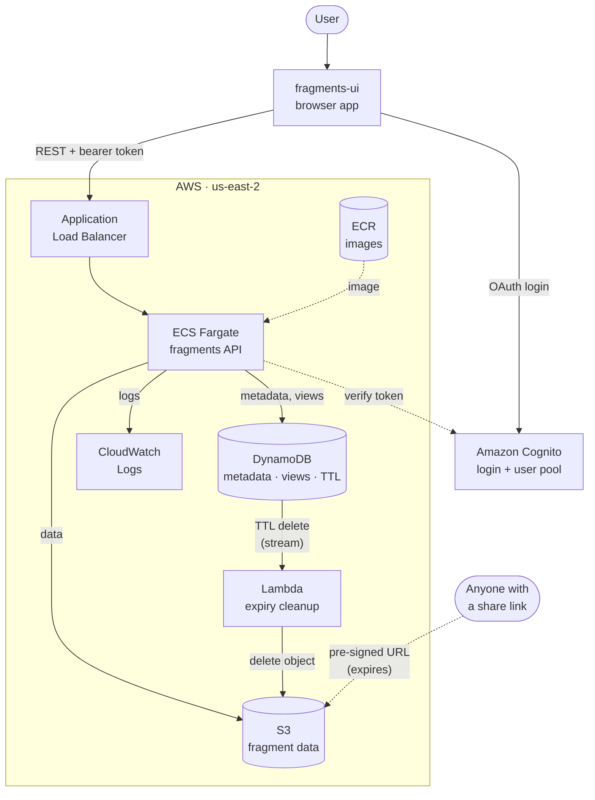
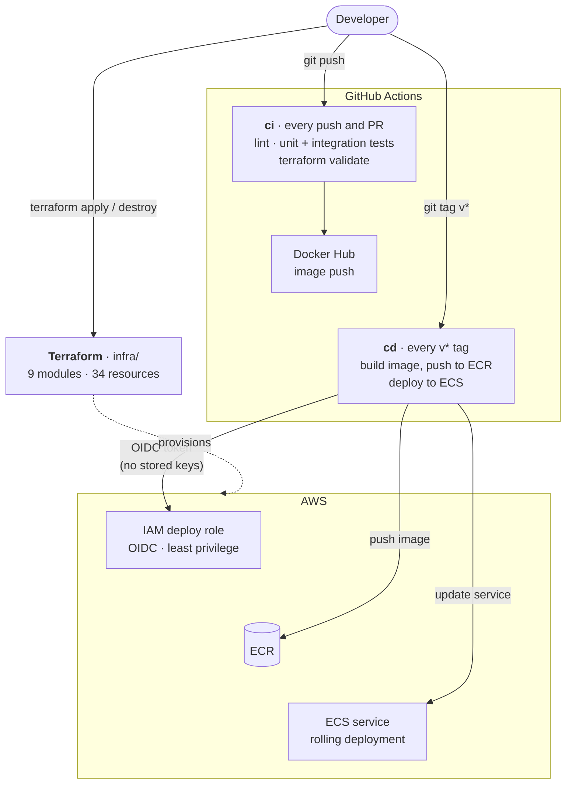
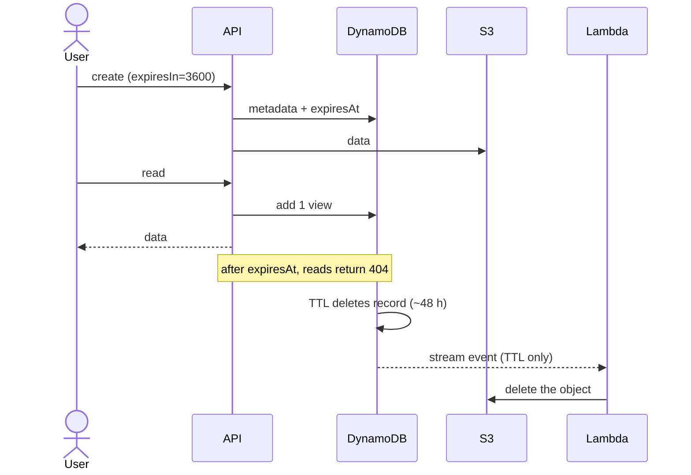

# Fragments

[](https://github.com/AjayMaan13/fragments/actions/workflows/ci.yml)

A cloud-native microservice for storing, converting, and sharing small pieces of data ("fragments") — text, JSON, XML, and images — with authenticated multi-user access. It runs as a containerized service on AWS Fargate, and **the entire environment is defined in Terraform**, so it can be created or destroyed with one command.

Every push runs a full test suite; every version tag builds a Docker image and rolls it out to AWS through GitHub Actions, authenticated with OIDC (no stored AWS keys).

**Demo video:** https://youtu.be/YJZaokns0F0
**Deployment:** on demand — created with `terraform apply` and torn down when not in use (see [Deploying to AWS](#deploying-to-aws)); the API's URL is printed by `terraform output api_url`
**Companion UI:** [fragments-ui](https://github.com/AjayMaan13/fragments-ui)

---

## What it does

- Authenticated users create, read, update, and delete fragments through a REST API
- Stores 12 content types: `text/plain`, `text/markdown`, `text/html`, `text/csv`, `application/json`, `application/yaml`, `application/xml`, and 5 image formats (`png`, `jpeg`, `webp`, `avif`, `gif`)
- **Converts on read** — 35 conversion paths, requested with a URL extension, without ever storing a second copy:
  markdown → HTML · JSON ↔ YAML · JSON ↔ XML · CSV → JSON · image ↔ image (via `sharp`) · markdown / plain text → **PDF** and **Word (.docx)**
- **Expiring fragments** (`?expiresIn=<seconds>`): they vanish from reads and lists immediately; DynamoDB TTL and a Lambda then delete the stored data from S3
- **View counts**, incremented atomically in DynamoDB
- **Temporary public share links** — pre-signed S3 URLs, capped at 1 hour and at the fragment's own expiry
- **Image thumbnails** on the fly (`?width=<pixels>`)
- Two swappable backends, chosen purely by environment variables:
  - **Auth:** HTTP Basic (local dev) or Amazon Cognito (production)
  - **Storage:** in-memory (local dev) or Amazon S3 + DynamoDB (production)

## Architecture



### Delivery pipeline

Terraform owns the infrastructure and the task definition's settings; CI/CD only ships new images.



### Life of an expiring fragment



## AWS services used

| Service | Role |
|---|---|
| **ECS (Fargate)** | Serverless container orchestration — runs the API with no managed EC2 instances |
| **ECR** | Private Docker image registry, pulled by ECS on deploy |
| **Elastic Load Balancing (ALB)** | Public entry point, routes traffic to healthy ECS tasks (HTTP; HTTPS is not enabled) |
| **S3** | Stores fragment data; public access blocked, shared only through expiring pre-signed URLs |
| **DynamoDB** | Fragment metadata (id, type, size, timestamps, view count, expiry), on-demand billing; TTL expires fragments and a stream reports the deletions |
| **Lambda** | Deletes an expired fragment's data from S3 when DynamoDB's TTL removes its record |
| **Cognito** | User authentication via OAuth 2.0 / OIDC hosted login; JWT bearer tokens verified server-side |
| **IAM** | Least-privilege task and execution roles, plus a GitHub OIDC deploy role so CI needs no stored AWS keys |
| **CloudWatch Logs** | Centralized structured logging (Pino JSON) from every container and the Lambda |
| **VPC** | Default VPC; security groups let only the load balancer reach the containers |

## Tech stack

- **Runtime:** Node.js, Express
- **Auth:** Passport (HTTP Basic + Bearer/Cognito JWT strategies), `aws-jwt-verify`
- **Data:** `@aws-sdk/client-s3`, `@aws-sdk/client-dynamodb`, `@aws-sdk/lib-dynamodb`, `@aws-sdk/s3-request-presigner`
- **Conversions:** `sharp` (image transcoding and resizing via libvips), `js-yaml`, `csvtojson`, `markdown-it`, `fast-xml-parser` (XML), `pdfkit` (PDF), `docx` (Word)
- **Infrastructure:** Terraform (9 modules)
- **Logging:** Pino (structured JSON logs, pretty-printed locally)
- **Security:** Helmet (security headers), CORS
- **Testing:** Jest (unit), Hurl (HTTP integration), Docker Compose with DynamoDB Local + MiniStack (S3-compatible mock) for local AWS-parity testing
- **CI/CD:** GitHub Actions — lint, Dockerfile lint (hadolint), unit and integration tests, Terraform format/validate, Docker Hub publish on every push to `main`; on every version tag, an ECR publish and rolling ECS deployment authenticated with GitHub OIDC
- **Containerization:** Multi-stage Dockerfile, production dependencies only in the final image

## Engineering highlights

- **~95% line test coverage** — 195 unit tests plus 14 Hurl integration test files covering every route, every conversion path, and both success and error cases
- **Everything as code** — every AWS resource is defined in Terraform, so the whole environment can be created, or destroyed to stop billing, with one command; CI/CD only ships images
- **No long-lived credentials in CI** — GitHub Actions assumes a least-privilege IAM role through OIDC, limited to this repository's version tags
- **Least-privilege IAM** — the running container can touch only its own S3 bucket and DynamoDB table, and only with the operations the code uses
- **Zero-downtime rolling deployments** — pushing a tag builds an image and deploys a new ECS task revision while the old one keeps serving until the new one is healthy
- **Environment-driven configuration** — the identical codebase runs against an in-memory store locally and real AWS in production, switched only by which environment variables are present
- **Content-negotiated conversions** — one stored fragment can be requested back in any compatible format via a URL extension (`.html`, `.yaml`, `.pdf`, `.docx`, `.jpg`, …), computed on the fly
- **Atomic counters and self-cleaning data** — view counts use DynamoDB's atomic `ADD`; expiry is enforced on read and cleaned up asynchronously through a DynamoDB stream and Lambda

## API overview

| Method | Route | Description |
|---|---|---|
| `GET` | `/` | Health check (includes server hostname, useful for verifying load balancing) |
| `POST` | `/v1/fragments` | Create a new fragment (`?expiresIn=<seconds>` makes it expire, up to 30 days) |
| `GET` | `/v1/fragments` | List the authenticated user's fragments (`?expand=1` for full metadata) |
| `GET` | `/v1/fragments/:id` | Get a fragment's raw data |
| `GET` | `/v1/fragments/:id.ext` | Get a fragment converted to another supported format (`.html`, `.txt`, `.yaml`, `.json`, `.xml`, `.pdf`, `.docx`, image extensions) |
| `GET` | `/v1/fragments/:id/info` | Get a fragment's metadata only (includes `viewCount` and `expiresAt`) |
| `GET` | `/v1/fragments/:id/share` | Get a temporary public link to the fragment's data (`?expiresIn=<seconds>`, default 15 min, max 1 hour) |
| `PUT` | `/v1/fragments/:id` | Replace a fragment's data (its type is immutable) |
| `DELETE` | `/v1/fragments/:id` | Delete a fragment |

Image fragments accept `?width=<pixels>` on reads (with or without an extension) to return a smaller copy, e.g. `/v1/fragments/:id.webp?width=200`.

All `/v1/*` routes require authentication (HTTP Basic locally, or a Cognito bearer token in production).

## Design notes and limitations

- **HTTP only.** The load balancer serves plain HTTP; there is no custom domain or TLS certificate. Adding HTTPS would mean a domain plus an ACM certificate, or CloudFront in front.
- **Expiry is enforced on read.** DynamoDB's TTL can take up to about 48 hours to delete a record, so the API treats an expired fragment as missing immediately; the S3 data is then removed by the cleanup Lambda.
- **Share links are capped at 1 hour.** They are signed with the task role's temporary credentials, which rotate. Shared reads go straight to S3, so they are not counted as views.
- **PDFs are Latin-text only.** The built-in PDF fonts cover Latin characters; other scripts and emoji do not render. Bold, italics, and links in markdown are flattened to plain text.
- **PDF and Word are output formats.** They can be produced from markdown or plain text, but not uploaded as fragments.
- **On-demand deployment.** The load balancer and Fargate task cost money while running, so the intended workflow is `terraform apply` to work and `terraform destroy -target=module.ecs -target=module.alb` when done.

## Repository layout

```
src/                 Express API (routes, model, auth, data backends, conversions)
tests/unit/          Jest unit tests          tests/integration/   Hurl HTTP tests
infra/               Terraform: root config + 9 modules (network, alb, ecs, ecr, iam,
                     storage, auth, events (Lambda), cicd (GitHub OIDC role))
.github/workflows/   ci.yml (tests, lint, terraform validate) and cd.yml (deploy on tag)
docs/                Planning notes
```

---

## Deploying to AWS

All infrastructure is defined in `infra/` (Terraform); CI/CD only ships new images. To stand it up in a fresh AWS account:

1. Install [Terraform](https://developer.hashicorp.com/terraform/install) and run `aws configure` for the target account.
2. `cd infra && terraform init && terraform apply` — creates ECR, S3, DynamoDB (with TTL, a stream and a cleanup Lambda), Cognito, the load balancer, an ECS service (0 tasks for now) and the GitHub deploy role.
3. In the GitHub repo, add an Actions **variable** `AWS_DEPLOY_ROLE_ARN` set to `terraform output github_deploy_role_arn`.
4. Push a version tag (`npm version patch && git push --follow-tags`). The `cd` workflow builds and pushes the image to ECR and deploys it.
5. `terraform apply -var desired_count=1` starts the service. Copy `api_url` and the Cognito values from `terraform output` into `fragments-ui/.env`.

To stop billing, `terraform destroy -target=module.ecs -target=module.alb` removes only the load balancer and service (data and users are kept); `terraform destroy` removes everything.

---

## Local Development

### Prerequisites

- [Node.js](https://nodejs.org/en) (LTS version)
- npm (comes with Node.js)
- [Docker](https://www.docker.com/) (for running the full stack with AWS-compatible mocks)

### Setup

```sh
npm install
```

### Running the server

```sh
npm start          # production mode
npm run dev         # auto-restarts on file changes
npm run debug        # with the Node debugger attached
```

By default the server runs on **http://localhost:8080**. Check it's running:

```sh
curl -s localhost:8080 | jq
```

```json
{
  "status": "ok",
  "description": "fragments service running normally",
  "author": "Ajaypartap Singh Maan",
  "githubUrl": "https://github.com/AjayMaan13/fragments",
  "version": "0.8.0",
  "timestamp": "...",
  "hostname": "..."
}
```

### Running the full local stack (S3 + DynamoDB mocks)

```sh
docker compose up --build -d
./scripts/local-aws-setup.sh
```

This starts the API alongside `dynamodb-local` and `MiniStack` (an S3-compatible mock), giving you AWS-parity behavior without touching real AWS resources.

### Testing

```sh
npm run lint            # ESLint
npm test                # Jest unit tests
npm run coverage         # Jest with coverage report
npm run test:integration  # Hurl integration tests (requires the Docker Compose stack running)
```

### Environment variables

| Variable | Purpose |
|---|---|
| `PORT` | Server port (default `8080`) |
| `NODE_ENV` | `production` disables HTTP Basic Auth |
| `HTPASSWD_FILE` | Enables HTTP Basic Auth (dev only, mutually exclusive with Cognito vars) |
| `AWS_COGNITO_POOL_ID` / `AWS_COGNITO_CLIENT_ID` | Enables Cognito auth |
| `AWS_REGION` | If set, switches the data layer from in-memory to S3/DynamoDB |
| `AWS_S3_BUCKET_NAME` / `AWS_DYNAMODB_TABLE_NAME` | Target AWS storage resources |
| `API_URL` | Used to build the `Location` header on fragment creation |
| `FRAGMENTS_LOG_LEVEL` | Pino log level (`info` in production, `debug` for troubleshooting) |
